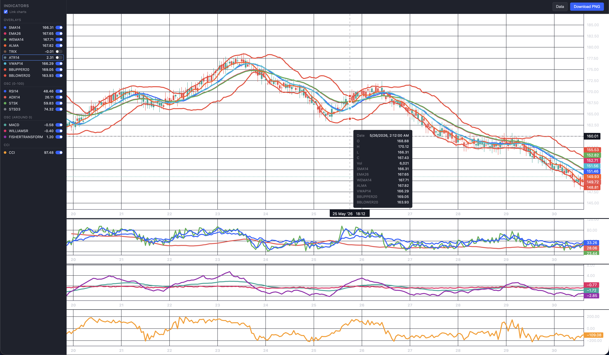

<p align="center">
  
</p>

<h1 align="center">Tala - Technical Analysis Library for Assets</h1>

<p align="center">Fluent chain API, zero runtime dependencies, dual CJS/ESM output, and built-in charting.</p>

<p align="center">
  <a href="https://jimzandueta.github.io/tala/docs/">📖 Full documentation →</a>
</p>

<p align="center">
  <a href="https://www.npmjs.com/package/@jimzandueta/tala"></a>
  <a href="https://github.com/jimzandueta/tala/actions/workflows/ci.yml"></a>
  <a href="https://github.com/jimzandueta/tala/tags"></a>
  <a href="LICENSE"></a>
  <br>
  <a href="https://www.typescriptlang.org/"></a>
</p>

---

## Install

```bash
npm install @jimzandueta/tala
```

Charting requires an optional peer dependency:

```bash
npm install lightweight-charts
```

## Quick Start

```typescript
import { tala } from "@jimzandueta/tala";

const result = tala()
  .sma(14)
  .ema(12)
  .rsi(14)
  .macd(
    { fastPeriod: 12, slowPeriod: 26, signalLength: 9 },
    { includeSignal: true },
  )
  .run(history);

result[0].sma14; // most recent SMA-14
result[0].rsi14; // most recent RSI (0-100)
result[0].macd; // most recent MACD line
```

Cross/signal events with structured output:

```typescript
const { history: enriched, signals } = tala()
  .sma(14)
  .macdCross()
  .rsiCross()
  .run(history, { structured: true });

signals.macdCross; // PriceHistoryEntry[] of cross events
signals.rsiCross; // PriceHistoryEntry[] of cross events
```

## Charting

`chart()` is a terminal method that renders indicators on an interactive TradingView-style page. It works in two modes.

### HTML mode

Writes a self-contained HTML file. Open it in any browser — no server needed.

```typescript
await tala()
  .sma(14)
  .ema(26)
  .bb(20, 2)
  .macd()
  .rsi(14)
  .chart(history, { format: "html" });
```

- Full candlestick chart with all indicators
- Editable data table — tweak OHLCV values and see candles update live
- Per-pane hover tooltips, legend toggles, time-scale sync, PNG export

### Server mode

Starts a local HTTP server that opens the browser automatically. Adds one thing HTML mode can't do: recalculate indicators after editing data.

```typescript
await tala().sma(14).rsi(14).chart(history, { format: "server", port: 3000 });
```

Click **Data** → edit OHLCV values → click **Recalculate** → indicators re-run on the server and the chart refreshes with new SMA, RSI, MACD, etc.

Chart output includes:

- Candlestick chart with overlay indicators (SMA, EMA, Bollinger Bands, etc.)
- Oscillator panes grouped by compatible scales: 0–100 (RSI, ADX, Stoch), centered (MACD, Williams %R, Fisher), wide-range (CCI)
- Hover tooltips per pane with all indicator values
- Sidebar legend with toggle switches for each indicator
- Time-scale sync across all panes (toggle off for independent scrolling)
- PNG export via html2canvas
- Editable data modal with server-side recalculation



Options:

| Option     | Type                 | Default                    | Description                                              |
| ---------- | -------------------- | -------------------------- | -------------------------------------------------------- |
| `format`   | `'html' \| 'server'` | `'server'`                 | `'html'` writes a file, `'server'` starts an HTTP server |
| `filePath` | `string`             | `'./demo/tala-chart.html'` | Output path for HTML mode                                |
| `port`     | `number`             | `7890`                     | Port for server mode                                     |
| `title`    | `string`             | `'tala chart'`             | Chart title                                              |

Run `demo/test-viz.ts` to generate a sample chart, or `demo/test-server.ts` for the live server.

## Indicators

| Category        | Methods                                                                                |
| --------------- | -------------------------------------------------------------------------------------- |
| Moving Averages | `.sma()` `.ema()` `.wema()` `.alma()` `.trix()`                                        |
| Momentum        | `.macd()` `.rsi()` `.cci()` `.adx()` `.fisher()` `.sts()` `.williamsR()` `.stochRSI()` |
| Volatility      | `.bb()` `.atr()`                                                                       |
| Volume          | `.obv()` `.vwap()`                                                                     |
| Price Levels    | `.pivotT()` `.fibRL()`                                                                 |
| Cross Signals   | `.macdCross()` `.rsiCross()` `.cciCross()` `.almaCross()` `.fisherCross()`             |

Each indicator appends a key to `PriceHistoryEntry` (for example, `.sma(14)` writes `entry.sma14`).

## License

MIT
